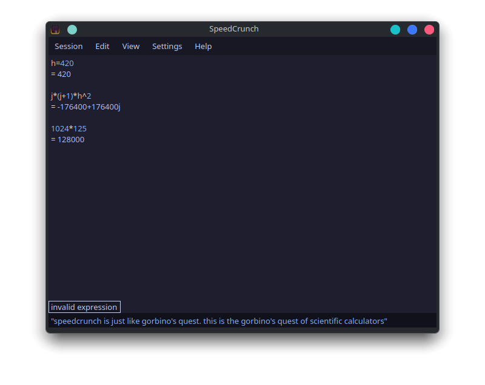

# Catppuccin Mocha Theme for SpeedCrunch
A Catpuccin theme for Speedcrunch that totally ignores the Catpuccin style guide.

## Installation

1. Move `catppuccin-mocha.json` to `~/.local/share/SpeedCrunch/color-schemes/`
2. In Speedcrunch, `Settings` > `Display` > `Color Scheme` > `catppuccin-mocha`

## Screenshot

  

